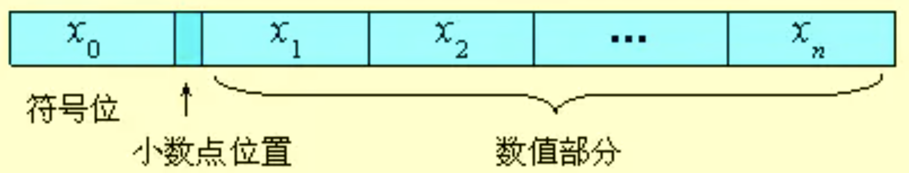
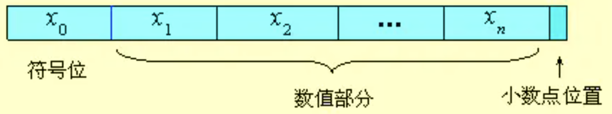
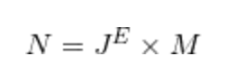
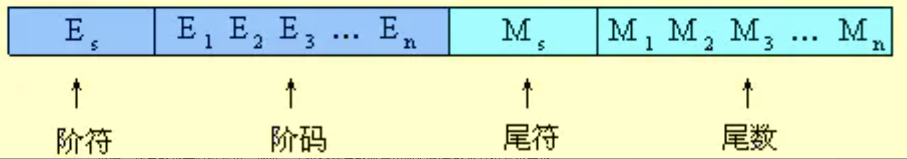
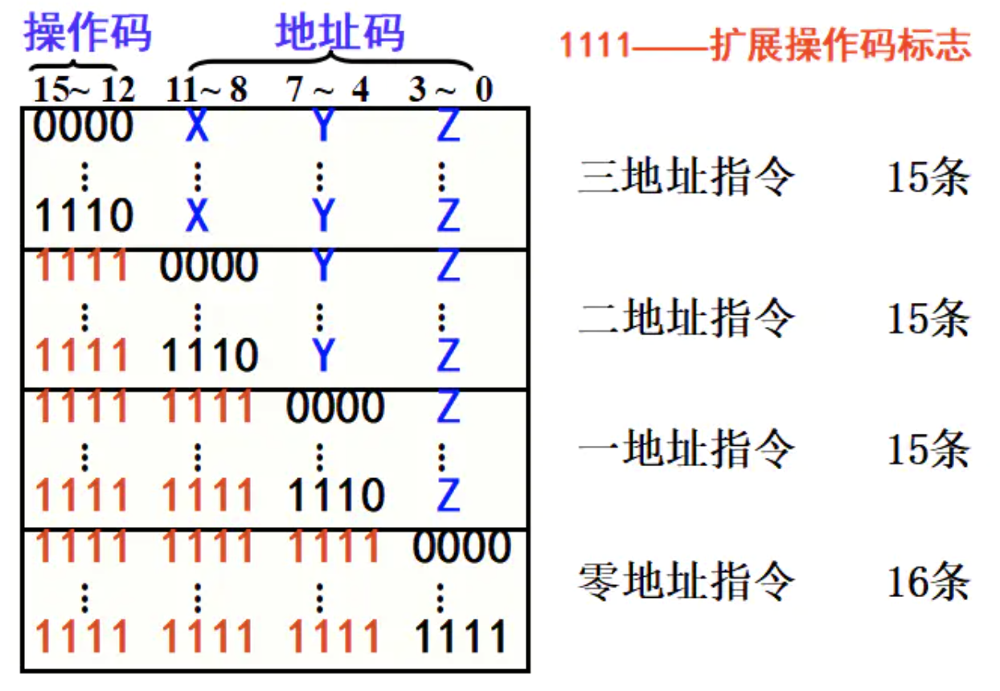
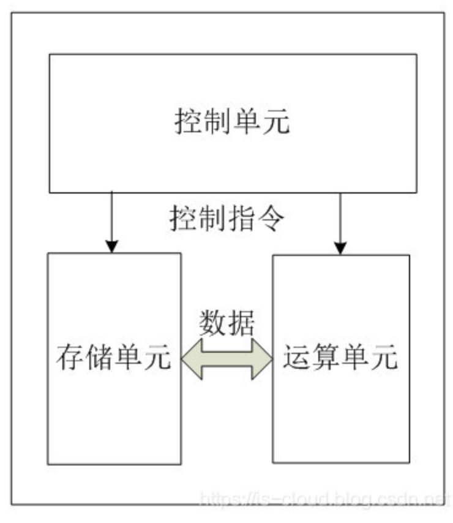
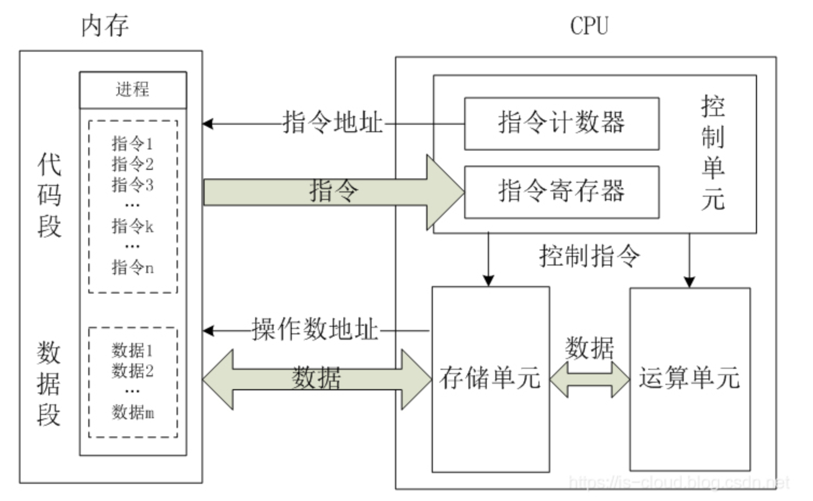
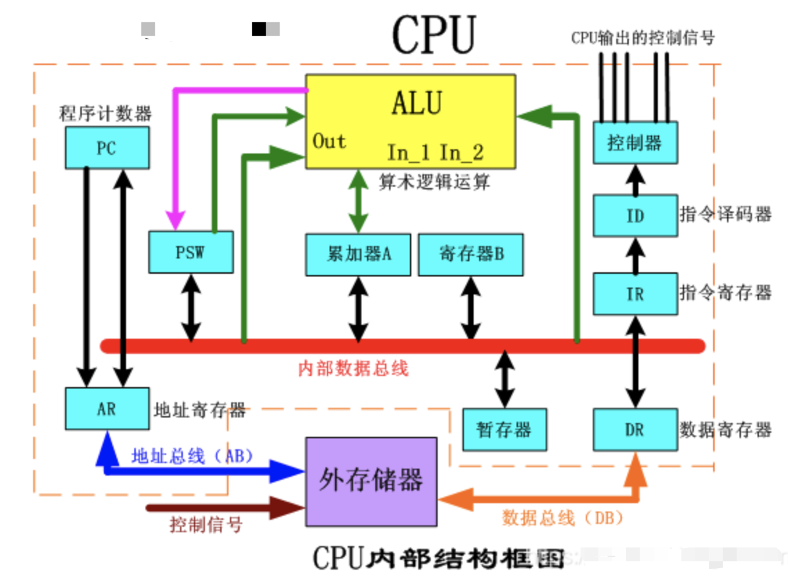
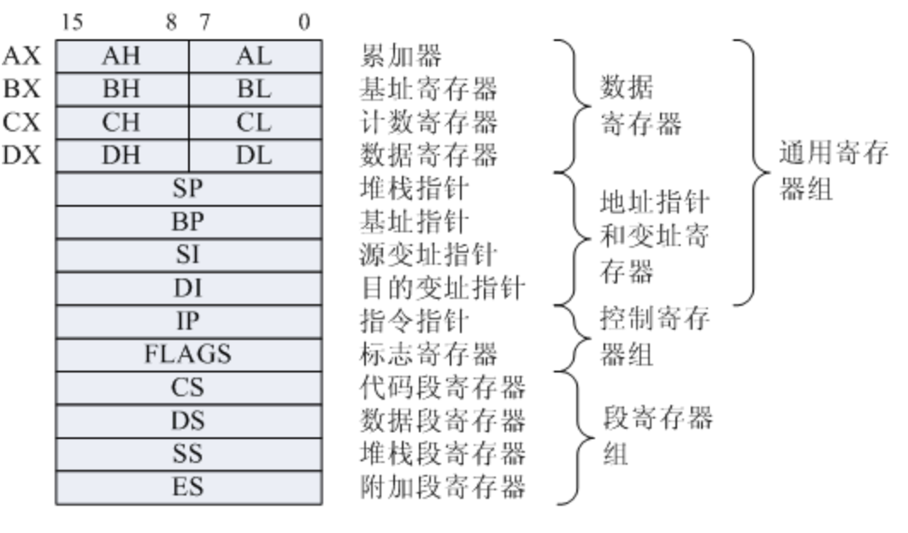
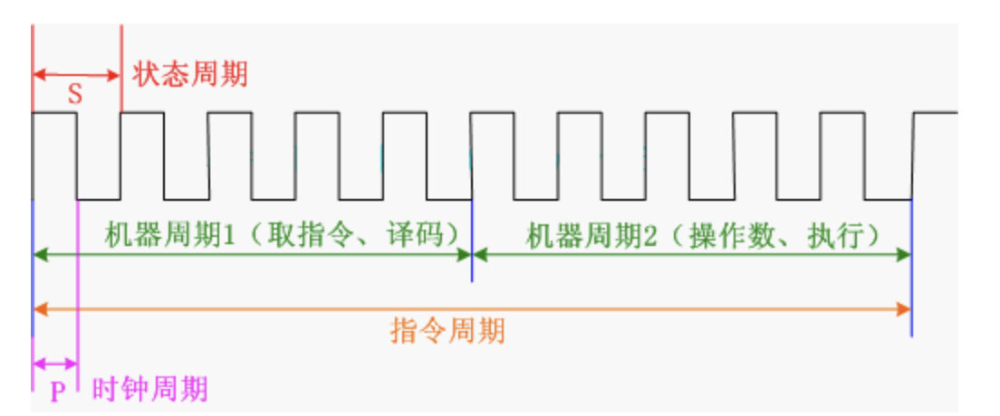

## 一、运算方法和运算部件

### 1.1 数据的表示方法和转换

带符号的二进制数据在计算机中的表示方法及加减法运算

#### 1.1.1 原码

定义：原码就是符号位加上真值的绝对值, 即用第一位表示符号, 其余位表示值. 比如如果是8位二进制。

> [+1]原 = 0000 0001
>
> [-1]原 = 1000 0001

特点:

1. 值+0，-0的原码分别为00000、10000，形式不唯一；
2. 正数的原码码值随着真值增长而增长，负数的原码码值随着真值增长而减少。

运算：绝对值相加减，由数值大小决定运算结果符号

#### 1.1.2 补码

定义：正数的反码是其本身，负数的反码是在其原码的基础上, 符号位不变，其余各个位取反。

> [+1] = [00000001]原 = [00000001]反
>
> [-1] = [10000001]原 = [11111110]反

特点：

1. 数值零的补码表示唯一；
2. 正数补码码值随着真值增大而增大，负数补码码值随着真值增大而增大。

#### 1.1.3 反码

定义：正数的补码就是其本身，负数的补码是在其原码的基础上, 符号位不变, 其余各位取反, 最后+1. (即在反码的基础上+1)

> [+1] = [00000001]原 = [00000001]反 = [00000001]补
>
> [-1] = [10000001]原 = [11111110]反 = [11111111]补

 特点：

1. 数值零的反码表示不唯一；
2. 正数反码码值随着真值增大而增大，负数反码码值随着真值增大而增大。

#### 1.1.4 移码

定义：移码 = 补码符号位取反

特点：

1. 最高位是符号位；
2. 1表示正，0表示负，数据0有唯一的编码，移码码值随着真值增大而增大。

#### 1.1.5 补，反，原，移码的相互转换

- 反码 -> 原码
  - 方法：符号位不变，正数不变，负数数值部分取反。
- 补码 -> 原码
  - 方法1：正数不变，负数数值部分求反加1。
  - 方法2：串行转换，从最后开始数，遇到第一个“1”，除第一个“1”不变，前面数字分别取反
- 移码 -> 原码
  - 方法：移码转换为补码，再转换为原码
- 数据从补码和反码表示形式转换成原码
  - 自低位开始转换，从低位向高位，在遇到第一个1之前，保存各位的0不变，第一个1也不变，以后得各位按位取反，最后保持符号位不变，经历一遍后，即可得到补码

### 1.2 定点数和浮点数

#### 1.2.1 定点数

所谓定点，就是约定机器中数据的小数点位置固定不变。在计算机中，通常将数据的小数点固定在数据的最高位之前或者最低位之后。前者称为**定点小数**，后者称为**定点整数**。

**定点小数**是纯小数，约定的小数点位置在符号位之后、有效数值部分最高位之前。若数据 x 的形式为 x = x0.x1x2…xn ( 其中x0为符号位，x1～xn是数值的有效部分，也称为尾数， x1为最高有效位 )，则在计算机中的表示形式为：

  
 

**定点整数**是纯整数，约定的小数点位置在有效数值部分最低位之后。若数据 x 的形式为 x = x0 x1x2…xn ( 其中x0为符号位，x1～xn 是尾数， xn 为最低有效位 )，则在计算机中的表示形式为：

  
 

#### 1.2.1 浮点数

与科学计数法相似，任意一个J进制数N，总可以写成：

  
 

式中M称为数 N 的**尾数(mantissa)**，是一个纯小数；E 为数 N 的**阶码(exponent)**，是一个整数，J称为比例因子 J^(E)的**底数**。这种表示方法相当于数的小数点位置随比例因子的不同而在一定范围内可以自由浮动，所以称为**浮点表示法**。

底数是事先约定好的(常取2)，在计算机中不出现。在机器中表示一个浮点数时，一是要给出尾数，用定点小数形式表示。尾数部分给出有效数字的位数，因而决定了浮点数的表示精度。二是要给出阶码，用整数形式表示，阶码指明小数点在数据中的位置，因而决定了浮点数的表示范围。浮点数也要有符号位。因此一个机器浮点数应当由阶码和尾数及其符号位组成：

  
 

#### 1.2.3  四则运算

- 加法
- 减法
- 乘法
- 除法

# 二、指令系统

### 2.1 指令格式

结构(操作码+地址码)

  
 

#### 2.1.1 操作码

- 操作数的地址

- 操作结果的存储地址

- 下一条指令的地址

#### 2.1.2 地址码

- 零地址指令

- 一地址指令

- 二地址指令

- 三地址指令

- 多地址指令

### 2.2 指令字长

- 取决因素
  - 操作码的长度
  - 操作数地址的长度
  - 操作数地址的个数
- 指令字长固定
  - 指令字长 = 存储字长
- 指令字长可变
  -  按字节的倍数变化

### 2.3 寻址方式

寻址方式分为 指令寻址方式 和 地址寻址方式。

#### 2.3.1 指令寻址方式 

##### **顺序寻址方式**

指令地址在内存中按顺序安排，当执行一段程序时，通常是一条指令接一条指令的顺序进行。

指令的顺序寻址方式，必须使用程序计数器PC来计数指令的顺序号，该顺序号就是指令在内存中的地址。

##### **跳跃寻址方式**

所谓跳跃，是指下条指令的地址码不是由程序计数器给出，而是由本条指令给出。

#### 2.3.1地址寻址方式

##### **隐含寻址**

不是明显地给出操作数的地址，而是在指令中隐含着操作数的地址。

> 操作数在专用寄存器中

##### **立即寻址**

指令的地址字段指出的不是操作数的地址，而是操作数本身。
 特点：指令中包含的操作数立即可用，节省了访问内存的时间。

> 操作数=A.

##### **直接寻址**

特点：在指令格式的地址字段中直接指出操作数在内存的地址A。
 如果用D表示操作数，那么直接寻址的表达式为:D=(A).

> EA=A.

##### **间接寻址**

相对于直接寻址而言，指令地址字段中的形式地址A不是操作数D的真正地址，而是操作数地址的指示器。
 两次访存，影响指令执行速度。

> EA=(A).

##### **寄存器寻址**

当操作数不在内存中，而是放在CPU的通用寄存器中，可采用寄存器寻址方式。
 指令结构中的RR型指令，就是采用寄存器寻址方式的例子。

> EA=R

##### **寄存器间接寻址**

与寄存器寻址的**区别**：
 指令格式中的寄存器内容不是操作数，而是操作数的地址，该地址指明的操作数在内存中。

> EA=(R).

##### **偏移寻址**

直接寻址和寄存器间接寻址的结合。

> EA=A+(R)；

常用的三种偏移寻址：

> **相对寻址**：EA=A+(PC);引用的专用寄存器是程序计数器（PC）.
>  **基址寻址**：EA=A+(R);引用的专用寄存器是基址寄存器.
>  **变址寻址**：EA=A+(R);引用的专用寄存器是变址寄存器.

##### **段寻址方式**

> EA=A+(R)；

##### **堆栈寻址**

> EA=栈顶

###  2.4 指令系统

精简指令系统计算机（RISC）——用于小型机

复杂指令系统计算机（CISC）——用于大型机

## 三、中央处理器

微处理器的出现得益于集成电路的发展，将控制器和运算器集成在一个芯片上，称为中央处理器（CPU）。CPU 从逻辑上可以分为 3 个模块：控制单元、运算单元和存储单元，这三部分由 CPU 的片内总线连接起来。

**注**：片内总线，指计算机各芯片内部传送信息的通道。

  
 

### 3.1 工作原理

控制单元在时序脉冲的作用下，从程序入口将第一条指令的地址写入 PC 程序计数器（本质是寄存器），控制单元将 PC 程序计数器的指令地址送到地址总线上，CPU 就将这个地址指向的指令读到 IR 指令寄存器，再通过 ID 指令译码器进行译码，了解指令的操作内容和操作数。对于执行指令过程中所需要用到的操作数，会将操作数的地址码也送到地址总线上，CPU 就将这个地址指向的数据读取到寄存器组中暂存起来，最后 OC 操作控制器发出控制型号到运算单元，由运算单元完成对数据的加工处理。然后 PC 程序计数器自增，周而复始，一条一条指令执行下去，直到停电为止。

  
 

**将过程简化为下述步骤**：

1. 取指令
2. 分析指令
3. 执行指令
4. 修改指令计数器

### 3.2 控制单元

控制单元是 CPU 的指挥控制中心，主要由 PC 程序计数器、指令寄存器 IR（Instruction Register）、指令译码器 ID（Instruction Decoder）和操作控制器 OC（Operation Controller）组成。控制单元工作时，PC 根据程序依次从存储器中取出一条条指令并暂存在 IR 中，通过 ID 分析指令的内容，以确定应该进行什么操作，然后通过 OC 按照确定的时序，向相应的部件发出微操作控制信号。OC 中主要包括节拍脉冲发生器、控制矩阵、时钟脉冲发生器、复位电路和启停电路等控制逻辑。

  
 

**PC 程序计数器**：又叫 PC 寄存器（Program Counter Register），本质是指令地址寄存器（Instruction Address Register）。存放当前正在执行的指令的地址或即将要执行的下一条指令的地址。有两种方式形成指令地址：一是顺序执行通过程序计数器 +1 得到下一条指令的地址；二是跳跃执行通过跳转类指令得到下一条指令的地址。

**IR 指令寄存器（Instruction Register）**：区别于指令地址寄存器，是存放当前正在执行的指令。以便在指令执行的过程中控制完成一条指令的全部功能。

**ID 指令译码器**：对指令的操作码（OPCODE）进行解析，并产生相应的控制型号。

**脉冲源及启停线路**：脉冲源产生一定频率的脉冲作为 CPU 的时钟脉冲，是 CPU 工作周期的基准信号。而启停线路则保证了可靠地送出或封锁完整的时钟脉冲。

**时序控制信号形成部件**：在 CLK 时钟的作用下，根据当前正在执行的指令的需要，产生对应的时间控制信号，并根据被控功能部件的反馈信号调整时序控制信号。

### 3.3 运算单元（运算器）

运算单元是可以执行算术运算（e.g. 加减乘除）和逻辑运算（e.g. 与或非、位移、比较）。运算单元所进行的全部操作都由控制单元发出的控制信号指挥，运算单元是单纯的执行部件。

**定点运算部件**：由逻辑运算部件（ALU）、若干个寄存器、移位电路、计数器和门电路组成。其中 ALU 主要完成加减法算术运算及逻辑运算。
**浮点运算部件**：由阶码运算部件和尾数运算部件组成。阶码部分仅执行加减法运算，尾数部分则可执行加减乘除运算。

### 3.4 存储单元（寄存器组和片内缓存）

存储单元是 CPU 暂存数据的地方，保存着等待处理的数据，或是已经处理过的数据。CPU 访问寄存器的速度比访问主存储器的速度更快，采用寄存器，可以减少 CPU 访问内存的次数，从而提高工作速度。但因为受到芯片面积和集成度的限制，寄存器组的容量不会很大。寄存器组可分为专用寄存器和通用寄存器。专用寄存器的作用是固定的，寄存相应的数据。而通用寄存器的用途则更加广泛，并可由程序员规定其用途。

寄存器由多个触发器（Flip-Flop）或锁存器（Latches）组成的简单电路，触发器和锁存器是两种原理不同的数字电路组成的逻辑门，属于数字电路领域。N 个触发器或锁存器就可以组成一个 N Bit 的寄存器，能够保存 N 为数据。我们常说的 64 位 Intel CPU，其寄存器就是 64 位的，所以其最大的直接寻址空间就为 2**64 bit。需要注意的是，并不是说寄存器是 64 位的，那么该 CPU 只支持使用 2**64 bit 的存储器空间，因为 CPU 除了支持直接寻址方式之外，还支持基址寄存器寻址方式，实现了基于内存分页的地址寻址方式，寻址空间得到了巨大的提升。

  
 

### 3.5 周期与流水线

#### 3.5.1 周期

**时钟脉冲**：指脉冲信号，是一个由 CPU 控制单元按一定电压幅度、一定时间间隔连续发出的电子脉冲信号，是计算机的基本工作脉冲，控制着计算机的工作节奏。时钟频率越高，时钟周期就越短，工作速度也就越快。

**时钟频率（Clock Speed）**：指同步电路中时钟脉冲的基础频率，是单位时间（1s）内所产生的时钟脉冲的个数。时钟频率是描述周期性循环信号在单位时间内所出现的次数，标准计量单位是 Hz（赫兹）。

**CPU 主频**：即 CPU 内部工作的时钟频率，是评定 CPU 性能的重要指标，一般来说主频数值越大越好。需要注意的是，主频仅是 CPU 性能表现的一个方面，而不代表 CPU 的整体性能，CPU 的运算速度还考虑流水线的各方面的性能指标（缓存、指令集、CPU 的位数等）。

**外频**：是 CPU 外部的工作频率，是由主板提供的基准时钟频率。CPU 主频和外频的关系：主频=外频×倍频。

**FSB 频**：是连接 CPU 和主板芯片组中的北桥芯片的前端总线（Front Side Bus）上的数据传输频率。

**时钟周期**：也称为振荡周期、P 周期或节拍脉冲，定义为时钟频率的倒数，即 (1/时钟频率)s，比如：8086/8088 系统的时钟频率为 4.77MHz，那么每个时钟周期约为 200ns。时钟周期在 CPU 的描述里也叫节拍，是 CPU 中最基本的、最小的时间单位，在一个时钟周期内，CPU 仅完成一个最基本的动作。时钟周期表示了 S/DRAM 所能运行的最高频率，更小的时钟周期就意味着更高的工作频率。

**状态周期**：也称为 S 周期，把时钟脉冲的周期定义为节拍（用 P 表示）。时钟脉冲经过二分频后定义为状态，即一个状态包含两个节拍，称为状态周期（用 S 表示）。

**机器周期**：在计算机中，为了便于管理，常把一条指令的执行过程划分为若干个阶段，每一阶段完成一项工作。例如：取指令、分析指令、执行指令、存储器读、存储器写等，此类每项工作称为一个基本操作。完成一个基本操作所需要的时间称为机器周期。一般情况下，一个机器周期由若干个状态周期组成。机器周期一般由 12 个时钟周期组成，也是由 6 个状态周期组成。

**指令周期**：指令周期是取出一条指令并执行这条指令的时间。一般由若干个机器周期组成，是从取指令、分析指令到执行完所需的全部时间。指令周期类型有非访内指令的指令周期、取数指令的指令周期、存数指令的指令周期、空操作指令和转移指令的指令周期。

  
 

**总线周期**：指 CPU 完成一次访问主存储器或 I/O 端口所需要的时间，一个总线周期由几个时钟周期组成。由于主存储器和 I/O 端口是挂接在总线上的，CPU 对主存储器和 I/O 接口的访问，是通过总线实现的。通常把CPU通过总线对微处理器外部（存储器或I/O接口）进行一次访问所需时间称为一个总线周期。

####  3.5.2 流水线

CPU 流水线（Pipeline），亦称管线，是现代计算机处理器中必不可少的部分，是指将计算机指令处理过程拆分为多个步骤，并通过多个硬件处理单元并行执行来加快指令执行速度。其具体执行过程类似工厂中的流水线，并因此得名。流水线主要分为 **指令执行流水线** 和 **运算操作流水线**（如：浮点加法运算）两类。

# 微信公众号

更多精彩内容将发布在微信公众号 **闾丘说** 上，你也可以在公众号后台和我交流学习和求职相关的问题。

  
 

