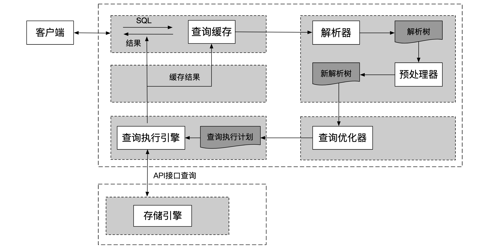
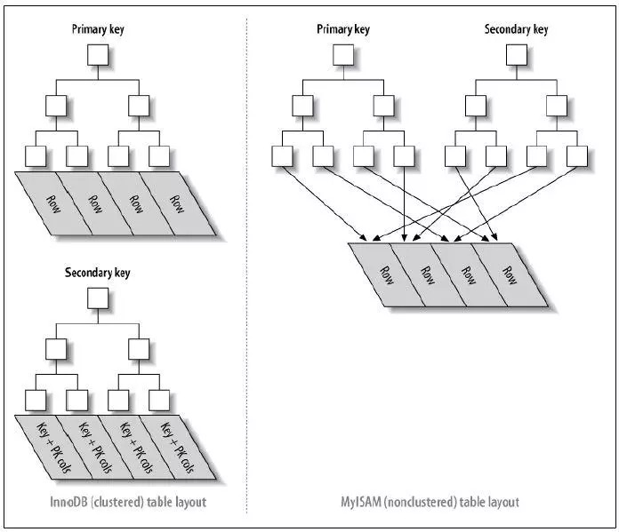
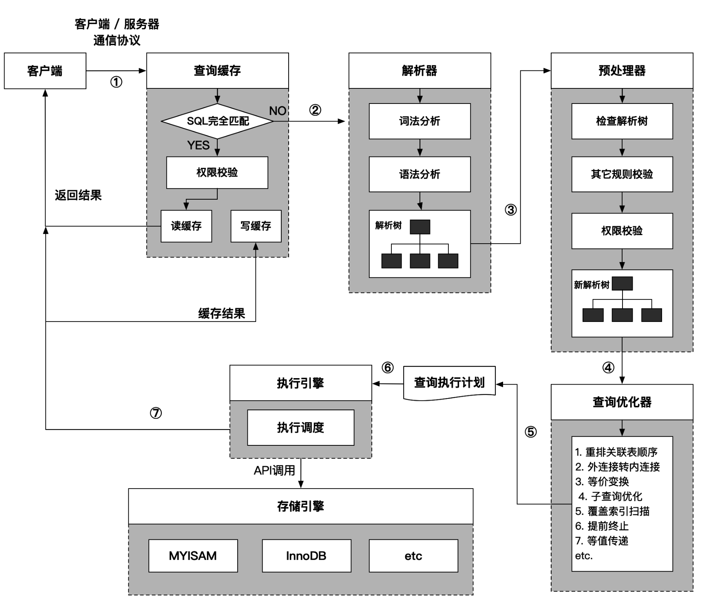

<!-- GFM-TOC -->

* [一、存储引擎](#一、存储引擎)
  * [1.1 数据组织](#1.1 数据组织)
  * [1.2 聚集方式](#1.2 聚集方式)
  * [1.3 事务处理](#1.3 事务处理)
  * [1.4 Catalog](#1.4 Catalog)
* [二、查询引擎](#二、查询引擎)<!-- GFM-TOC -->

  
 

# 一、存储引擎

数据库内核按层次来分，就是两层：SQL & Storage. SQL Layer负责将你输入的SQL statement通过一系列步骤(parse/resolve/rewrite/optimize…)转换成物理执行计划，同时负责计划的执行，执行计划通常是一颗树的形式，其中树的叶子节点(执行器算子)部分往往负责单表的数据操作，这些操作算子就要在storage layer来执行了。 因此，一个数据库存储引擎的主要工作，简单来讲就是存取数据，但是前提是保证数据库的ACID(atomicity/consistency/isolation/durability)语义。存储引擎对外提供的接口其实比较简单，主要就是数据写入/修改/查询，事务处理(start transaction/commit/rollback…), 修改schema对象/数据字典(可选), 数据统计, 还有一些周边的运维或数据导入导出功能。仅仅从功能上来说，要实现一个存储引擎似乎并不困难，如今也有很多Key-Value Store摇身一变就成为了数据库存储引擎，无非是加上一套事务处理机制罢了。但是作为数据库的底盘，一个成熟的存储引擎必须要考虑效率，如何高效(性能/成本最大化)的实现数据存取则成了在设计上做出种种权衡的主要考量。可以从存储引擎的几个主要组件来讨论：

### 1.1 数据组织

数据在内存和磁盘中的组织方式很大程度上决定了存取的效率，不同的应用场景选择也不同，典型的如 :

*a. 数据按行存储(NSM)*，对事务处理比较友好，因为事务数据总是完整行写进来， 多用于OLTP场景.

*b. 按列存储(DSM)*，把tuples中相同的列值物理上存储在一起，这样只需要读取需要的列，在大规模数据扫描时减少大量I/O，另外列存做压缩的效果更好，适合OLAP场景，但是事务处理就不那么方便，需要做行转列，所以大部分AP数据库事务处理效率都不怎么高，某些甚至只支持批量导入。

*c. 混合存储(FSM)*，行列混合布局，有把数据先按行分组(Segment, SubPage)，组内使用DSM组织，如PAX, RCFile，也有先按列分组(Column Group)，组内指定的列按NSM组织，如Peloton的Tile. 此种格式试图结合NSM和DSM两者的优点，达到处理混合负载(HTAP)的目的，但是同时也继承了两者的缺点。

所以做存储引擎，一开始就要面临选择何种存储格式的问题，即便选定了大类，每种格式中也有无数的细节需要考虑，每种数据类型的字段如何编码(Encoding)，行存中null/not null如何存储，是否需要列索引加快project operation，是否需要对列值进行重排，列存如何进行数据压缩，等等，都要存储空间和存取速度中做平衡。现代数据库为了应对复杂的应用场景，往往使用不只一种存储格式，比如Oracle有In-memory Column Store在内存中将行存的页面转换为列存方式的page，用来加速复杂查询。 

### 1.2 聚集方式

当数据选定存储格式以后，还要选择数据在磁盘和内存中的聚集方式。以按行存储为例，大部分存储引擎使用固定大小的页面(page)来存储连续的若干行，当然，数据行如何连续排列，有堆表(随机)和索引组织表(按索引序)两种，现在较为流行的LSM-Like的存储引擎使用不定大小的页面(称为DataBlock)，只支持按主键索引序聚集；这两种方式主要区别在于前者被设计为可更新的，每个page中会留有空间，后者是只读的，数据紧密存储不带padding，便于压缩。两者的区别实际上是因为事务处理机制有较大的区别导致的，后面再论。

对于In-Memory Database来说，数据组织的方式会有较大区别，因为不需要在内存和持久化存储中交换数据，内存中一般不会使用page形式，而是直接使用索引存储结构(比如B+Tree)直接索引到记录(tuples)，无需page这一层间接引用，减少cpu cache miss。

索引：B+索引、哈希索引、全文索引、空间数据索引

索引种类：InnoDB 主键使用的是聚簇索引，MyISAM 不管是主键索引，还是二级索引使用的都是非聚簇索引。

  
 

缓存的粒度一般是page，关键在于缓存替换算法，目前用的比较广泛的LRU,LFU,ARC..以及各种变种的算法都有在数据库中使用。另外还有一个是如何更有效的管理内存的问题，这点上，定长的page会比不定长的更有优势。当然还要考虑各种query pattern对cache的影响，如果单行查询较多，选用更细粒度(比如row)的cache会更有效率，但是淘汰的策略会更复杂，很多新的研究开始尝试引入机器学习的方法来优化cache淘汰算法，以及有效的管理cache.

### 1.3 事务处理

存储引擎之核心，保证数据库的ACID。要保证D，大家的做法都差不多，都是写WAL(Write Ahead Log)来做recovery，关键是如何高效的实现ACI，也就是所谓的多版本并发控制(MVCC)机制. MVCC的完整实现比较复杂，这里不去详细阐述，这里面的关键在于如何处理并发执行过程中的数据冲突(data race)，包括写写冲突，读写冲突；因为数据库的负载一般是读多写少的，要做到高效，只读事务不能被读写事务阻塞，这就要求我们的写不能直接去更新当前的数据，而是要有一套维护多版本数据的能力，当前的存储引擎管理多版本数据的办法无非两种：a. 写入数据原地更新，被更新的旧版本写到undo链中，写入代价大，事务处理复杂, 但是回收旧版本数据高效；b. 写入数据不直接更新原来的数据，而是追加为新版本，写入代价小，但是读，尤其是扫描需要读取层次较多，更为严重的问题是回收旧版本的数据需要做compact，代价很大。前一种称为ARIES算法比大多数主流数据库存储引擎使用，后一种称为LSM-Tree的结构也被很多新存储引擎使用，受到越来越多的关注。

### 1.4 Catalog

与KV store有区别的是，数据库是有严格的schema的，所以多数存储引擎中的记录都是有结构的，很多KV store在作为数据库存储引擎时，都是在中间做一层转换，将上层处理的tuples以特定的编码方式转换为binary key-value，写入KVStore, 并在读取到上层后，依靠schema解释为tuples格式供上层处理，这种方法当然可以工作，但是诸多优化无法实施：a. 数据迭代必须是整行，即便只需要其中一列，序列化/反序列化开销是免不了的。b. project和filter的工作无法下放到存储层内部进行处理; c. 没有列信息，做按列编码，压缩也不可能。d. schema change只能暴力重整数据… 因此要做到真正的高效，越来越多的存储引擎选择完全感知schema，存储细微结构。

schema是对一个数据库的结构描述。在一个关系型数据库里面，schema定义了表、每个表的字段，还有表和字段之间的关系。 

catalog是由一个数据库实例的元数据组成的，包括基本表，同义词，索引，用户等等。

...

以上所探讨的，还只是单机数据库的存储引擎几个大的问题，而现代数据库对存储引擎提出了更高的要求，可扩展，高可用已经成为标配，现在要考虑的是如何给你的存储引擎加上分布式的能力，而这又涉及到高可用一致性保证，自动扩展，分布式事务等一系列更为复杂的问题，这已远超出本文的范畴，需要另开篇章。

# 二、查询引擎

SQL Layer负责将你输入的SQL statement通过一系列步骤(parse/resolve/rewrite/optimize…)转换成物理执行计划，同时负责计划的执行，执行计划通常是一颗树的形式，其中树的叶子节点(执行器算子)部分往往负责单表的数据操作，这些操作算子就要在storage layer来执行了。

- 查询缓存：哈希表，key由查询语句本身，查询的数据库和客户端协议的版本等生成；
- 解析器：
- 预处理器：
- **查询优化**：使用Explain 进行分析、优化数据访问（减少请求数据量、减少服务器端扫描的行数）、重构查询方式（切分大查询、分解大连接查询）
- 执行计划：
- 执行查询：

  
 

